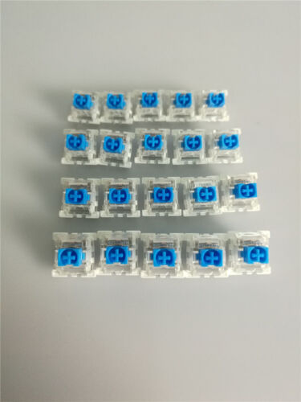
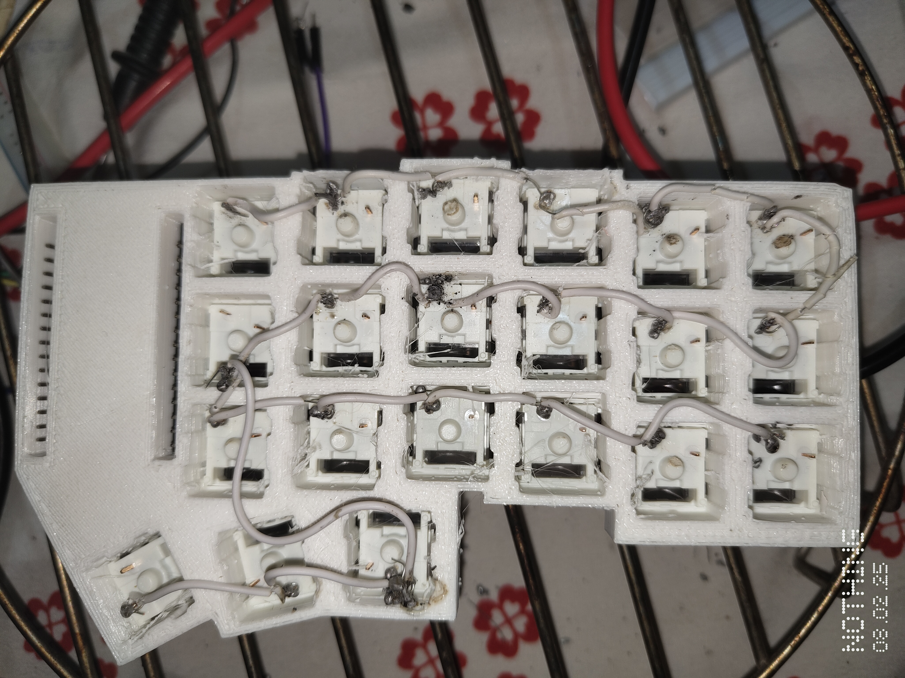

# Corne BLE ESP32 Keyboard Project 💻⌨️

Welcome to the Corne BLE ESP32 Keyboard Project! This repository contains all the resources needed to build a compact, efficient, and portable split keyboard using the ESP32 microcontroller, an 18650 Lithium-ion battery (2200mAh), and a TP4056 charging module. The keyboard is completely handwired—no PCB is used!

---

## Features 🚀

- **Wireless Bluetooth Connectivity**: Seamlessly connect to multiple devices via BLE.
- **ESP32-Powered**: Leverages the processing power and integrated Bluetooth of the ESP32.
- **Portable Power Supply**: Utilizes a high-capacity 2200mAh 18650 Li-ion battery.
- **Safe Charging**: Incorporates a TP4056 module for secure and efficient battery charging.
- **Handwired Build**: Custom wiring without the use of a PCB.
- **Custom 3D Printed Parts**: Includes a 3D printed case and top plate.
- **Premium Switches**: Equipped with Otemu Blue switches for a satisfying typing experience.

---

## Hardware Components 🛠️

- **ESP32 Microcontroller**: The brain behind the keyboard.
- **18650 Lithium-ion Battery (2200mAh)**: Long-lasting and reliable power source.
- **TP4056 Charging Module**: Manages safe charging of the battery.
- **Otemu Blue Switches**: Provides tactile feedback and crisp actuation.
- **Handwired Connections**: Custom wiring without a PCB.
- **3D Printed Parts**: Custom printed case and top plate.
- **Additional Components**: Key switches, wiring, enclosure materials, and other necessary parts.

---

## Getting Started 🚀

### Prerequisites

Before you begin, ensure you have the following:

- **Hardware**:
  - ESP32 development board
  - 18650 Lithium-ion Battery (2200mAh)
  - TP4056 Charging Module
  - Otemu Blue switches
  - Materials for handwiring (wires, solder, etc.)
  - 3D printed parts (case and top plate)

- **Software**:
  - [Arduino IDE](https://www.arduino.cc/en/software) or [PlatformIO](https://platformio.org/)
  - ESP32 libraries installed

---

## Firmware Overview 📟

The firmware, written in C++ using the Arduino framework, includes functionalities for:

- **Bluetooth Communication**: Establishing and maintaining wireless connections using the [BLEKeyboard ESP32 Library](https://github.com/T-vK/ESP32-BLE-Keyboard) for seamless keyboard emulation.
- **Key Scanning & Debouncing**: Efficiently reading key presses.
- **Power Management**: Coordinating power distribution and safe charging with battery monitoring.
- **Sleep Modes**: Implementing low power consumption using the Deep Sleep Library to extend battery life.

Feel free to explore and modify the code to tailor the keyboard's behavior to your needs!

---

## Media Showcase 📸🎥

### Otemu Blue Switches
<figure>
  
  <figcaption>Figure 1: Otemu Blue Switches installed in the keyboard.</figcaption>
</figure>

### 3D Printed Top Plate
<figure>
  
  <figcaption>Figure 2: Custom 3D printed top plate.</figcaption>
</figure>

### Back Plate (Physical Build)
<figure>
  
  <figcaption>Figure 3: The back plate as part of the physical build (model not available for download).</figcaption>
</figure>

### Handwiring Process
<figure>
  
  <figcaption>Figure 4: Detailed handwiring process.</figcaption>
</figure>

### Charging Module in Action
<figure>
  
  <figcaption>Figure 5: Charging module demonstrating battery charging capability.</figcaption>
</figure>

### Working Model Video
<figure>
  
  <figcaption>Figure 6: Watch the demonstration video of the working model on YouTube.</figcaption>
</figure>

---

## 3D Print Models 📐

The 3D print models available for download are located in the `3d_models` folder. They include:

- **Case Model**: `case_model.stl`
- **Top Plate Model**: `top_plate_model.stl`

Feel free to download, modify, and use these files for your own builds!

---

## License 📄

This project is licensed under the [MIT License](LICENSE).

---

## Acknowledgements 🙏

- **ESP32 Team**: Thank you to Espressif for creating such a versatile microcontroller.
- **BLEKeyboard & Deep Sleep Libraries Developers**: Kudos for providing reliable libraries that make wireless keyboard and power management features possible.
- **Community**: Gratitude to all open-source enthusiasts for their continuous support.

---

Happy Coding! 🚀💻⌨️

